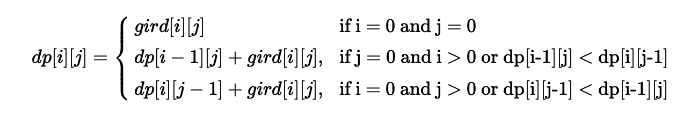

# 64-Minimum Path Sum

#### [最小路径和](https://leetcode-cn.com/problems/minimum-path-sum/)

题目描述：

给定一个包含非负整数的 *m* x *n* 网格，请找出一条从左上角到右下角的路径，使得路径上的数字总和为最小。

**说明：**每次只能向下或者向右移动一步。

**示例:**

```
输入:
[
  [1,3,1],
  [1,5,1],
  [4,2,1]
]
输出: 7
解释: 因为路径 1→3→1→1→1 的总和最小。
```

思路：动态规划

从起点开始只能向右或者向下前进，所以当前点受上方的点或者左边的点影响。

对 dp\[i][j]  = 当前点耗费 + 来源的最小耗费，所以可得状态转移方程：



```java
public class MinimumPathSum {
  public static int minPathSum(int[][] grid) {
    if (grid.length == 0) return 0;
    int i = grid.length, j = grid[0].length;
    int[][] dp = new int[i][j];
    for (int m = 0; m < i; m++){
      for (int n = 0; n < j; n++){
        if (m == 0 || n == 0){
          if (m > 0) dp[m][n] = dp[m-1][n] + grid[m][n];
          else if (n > 0) dp[m][n] = dp[m][n-1] + grid[m][n];
          else dp[m][n] = grid[m][n];
        } else {
          dp[m][n] += Math.min(dp[m-1][n], dp[m][n-1]) + grid[m][n];
        }
      }
    }
    return dp[i - 1][j - 1];
  }

  public static void main(String[] args) {
    int[][] data = new int[][]{{1, 3, 1}, {1, 5, 1}, {4, 2, 1}};
    System.out.print(minPathSum(data));
  }
}
```

