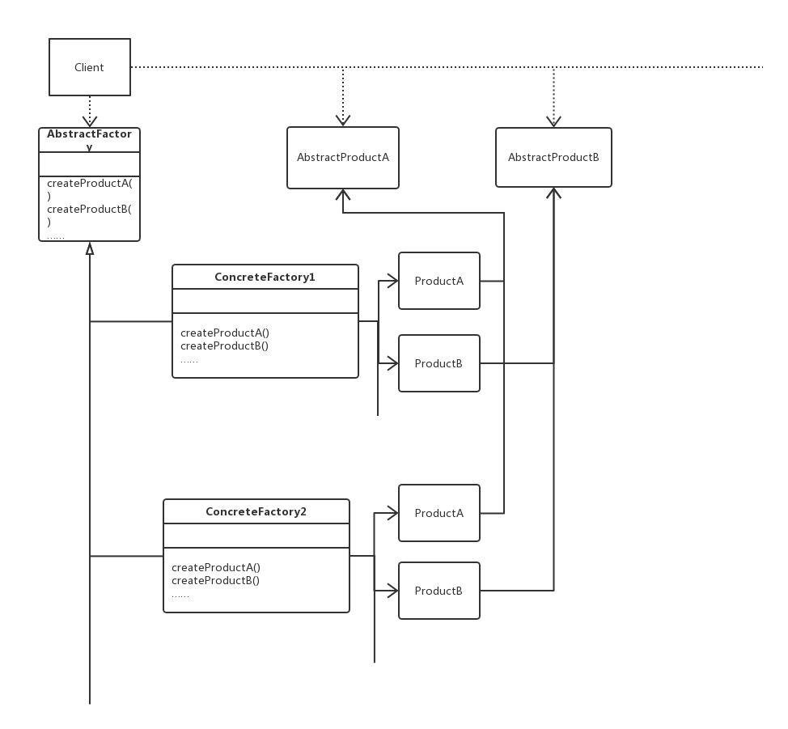

# 设计模式 | 抽象工厂模式

### 抽象工厂

##### 目的

抽象工厂模式提供了一个接口用以创建一个想联系或者相依赖的对象族，而无需指定他们的具体类。

##### 思路

先定义抽象类 `AbstractFactory` ，在类中声明创建各种组件的接口，在逐一为各基本组件定义想对应的抽象类，由具体子类来真正实现特定的功能。

##### 结构



##### 参与者职责

* 抽象工厂类：声明创建抽象产品对象的操作接口
* 具体工厂类：实现产生具体产品对象的操作
* 抽象产品类：声明一种产品对象的接口
* 具体产品类：定义将被相应的具体工厂类产生的产品对象并实现抽象产品类的接口
* 客户（Client）：仅使用抽象工厂类和抽象产品类声明的接口

### 原理实现

定义一个抽象工厂，零售商 Grocer，货物 A 和 B，我们定义货物的初始数据 name 和 size

```python
# __init__.py
class Grocer:
    """
    AbstractFactory
    """
    def __init__(self):
        self.name = "BOSS"

    def produce_a(self):
        return A()

    def produce_b(self):
        return B()

    def say_words(self):
        print(self.produce_a().get_data())
        print(self.produce_b().get_data())


class A:
    """
    AbstractProductA
    """
    def __init__(self):
        self.name = "A"
        self.size = "mid"

    def get_data(self):
        return self.name, self.size


class B:
    """
    AbstractProductB
    """
    def __init__(self, b_size="mid"):
        self.name = "B"
        self.size = "mid"

    def get_data(self):
        return self.name, self.size

```

定义两个具体工厂类，黑心销售商和好心销售商，分别自定义货物的 name 和 size，黑心商人将商品的尺寸减小了，而好心商人却将商品尺寸放大了。

```python
# myGrocer.py
from . import Grocer, A, B


class GoodMindGrocer(Grocer):
    """
    ConcreteFactory
    """

    def __init__(self):
        self.name = "好心商人"

    def produce_a(self):
        a = GoodA()
        return a

    def produce_b(self):
        b = GoodB()
        return b


class GoodA(A):
    """
    ConcreteProductA
    """

    def __init__(self):
        self.name = "A"
        self.size = "big"


class GoodB(B):
    """
    ConcreteProductB
    """

    def __init__(self):
        self.name = "B"
        self.size = "big"
from . import Grocer, A, B


class EvilMindGrocer(Grocer):
    """
    ConcreteFactory
    """
    def __init__(self):
        self.name = "黑心商人"

    def produce_a(self):
        a = EvilA()
        return a

    def produce_b(self):
        b = EvilB()
        return b


class EvilA(A):
    """
    ConcreteProductA
    """
    def __init__(self):
        self.name = "A"
        self.size = "small"


class EvilB(B):
    """
    ConcreteProductB
    """
    def __init__(self):
        self.name = "B"
        self.size = "small"

```

主函数调用


```python
# main.py
from myGrocer import EvilMindGrocer
from myGrocer import GoodMindGrocer

class Shop():
    def __init__(self, factory=None):
        self.factory = factory
    
    def show_data(self):
        print("你的选择结果是：")
        self.factory().say_words()
        
        
def select_grocer():
    choice = input()
    if choice == "e":
        g = Shop(EvilMindGrocer)
    elif choice == "g":
        g = Shop(GoodMindGrocer)
    else:
        print("Bey!")
    g.show_data()

    
if __name__ == "__main__":
    select_grocer()
```

> 运行程序后，更具我们不同的输入将产生不同的结果。

### 类似使用场景

* 程序GUI，不用将程序写死，根据我们的需要可轻易改变GUI，而不用大量改动代码
* 程序配置，使用抽象工厂模式，可以轻松切换配置，如开发模式配置和生产模式配置

……

### 总结

使用抽象工厂模式，可以让程序更加的灵活，使修改程序更加轻松，但也要根据具体的业务场景选择合适的设计模式。