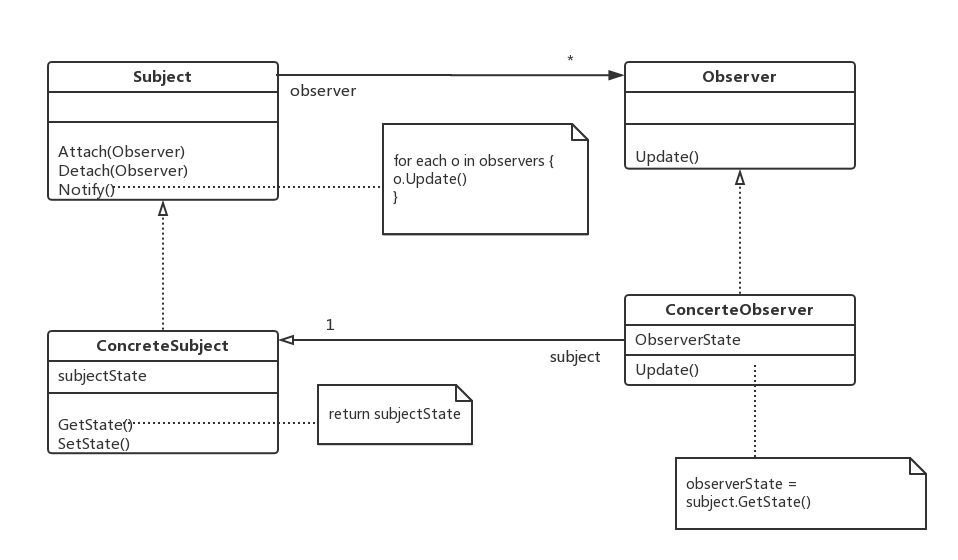
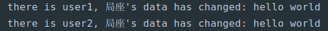

# 设计模式 | 观察者模式

### 观察者模式

> 定义了对象之间一对多依赖，当一个对象发生改变时，他的所有依赖者会接收到通知并更新状态。这种多对象之间的依赖是松耦合的，之间发生交互但不必了解彼此的实现细节。

***松耦合设计的重要性*** 

> 松耦合的设计可以帮助我们设计具有弹性的系统，将对象之间的依赖程度降到最低，方便在开发过程中对系统的迭代及维护。

### 观察者模式原理

在我们日常使用的软件当中，这种设计模式是十分常见的。

举个栗子：微博

作为社交网络的一个重要支柱，使用微博的人都会在其中关注某些人，朋友、明星、营销号……大 V 能有成万上数十万的粉丝，而你可能只有一两百，一半还是僵尸号……

这里拿局座举例子，当我们关注局座的微博时，观察者模式便已经起作用了，局座是消息中心，而我们是观察者。

关注局座的微博时，我们便 **完成了观察者的注册**。当**消息中心**（局座的微博）更新时，我们这些**观察者**（粉丝）便会接收到通知，然后前来吃瓜围观，参加战忽局的「 会议」。

某一天，某个吃瓜群众不想关注这些了，便取消了对局座（**消息中心**）的关注（**观察者完成取消注册**），这时候当消息中心发布消息时，取消注册的观察者也不会收到消息了。

再某天，局座（消息中心）发现自己的粉丝（观察者）中有僵尸粉，便移除了这些账号，这时候 **也完成了观察者的注册取消**，往后这些被移除的账号也不会收到来自消息中心的消息。

### 观察者模式类图



* 消息中心/主题 (Subject)：可识别其观察者，任意观察者皆可订阅一个消息中心，提供一个观察者与其连接和解除连接的接口。
* 观察者 (Observer)：定义一个自我更新的接口，更具消息中心的变化而发生变化。 
* 具体消息中心/主题 (ConcreteSubject)：具体的消息中心，存储观察者的具体订阅内容，其发生改变时，向其观察者发送通知。
* 具体观察者 (ConcreteObserver)：维持一个对具体消息中心的引用，存储与消息中心一致的状态，实现观察者的自我更新接口。

### 观察者模式 Python 简易实现

上面举了局座的例子，这里就实现一个类似的简易功能

```python
class AbstractSubject:
    def __init__(self):
        self.observers = set()

    # 添加观察者
    def attach(self, observer):
        if observer not in self.observers:
            self.observers.add(observer)

    # 移除观察者
    def detach(self, observer):
        if observer in self.observers:
            self.observers.remove(observer)

    # 通知所有已订阅的观察者
    def notify(self):
        for observer in self.observers:
            observer.update(self)


class AbstractObserver:
    def __init__(self, name):
        self.name = name

    # 更新自身状态
    def update(self, subject):
        print("there is {}, {}'s data has changed: {}".format(self.name, subject.name, subject.data))


class Subject(AbstractSubject):
    def __init__(self, name=None):
        super(Subject, self).__init__()
        self.name = name
        self._data = None

    # Python 语法，设置属性，更安全， 设置为@value.setter
    @property
    def data(self):
        return self._data

    @data.setter
    def data(self, val):
        self._data = val
        self.notify()


class Observer(AbstractObserver):
    pass


def main():
    user1 = Observer('user1')
    user2 = Observer('user2')
    user3 = Observer('user3')
    ju_zuo = Subject('局座')
    ju_zuo.attach(user1)
    ju_zuo.attach(user2)
    ju_zuo.data = "hello world"


if __name__ == "__main__":
    main()

```

输出结果：



通过结果可以看出只有user1和 user2 接收到了通知。