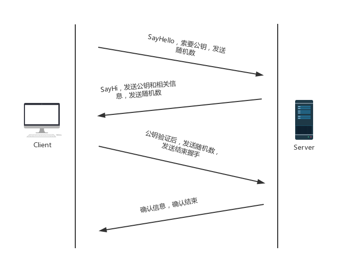
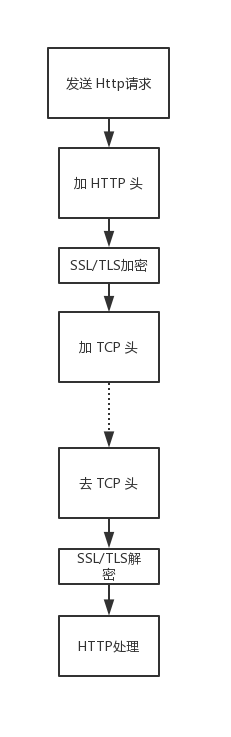

# HTTPS

## 概述

HTTPS 协议是基于 HTTP 协议增加 SSL/TLS 协议。

由于 HTTP 协议采用的是明文传输，在传输过程中，所有的信息是可见的，所以骇客在很轻易的截获信息后还能很容易的能修改这些信息，并能冒充用户身份进行非法操作。

SSL/TLS 协议规定客户端和服务器双方事先约定好公钥和私钥，所有的通信信息都经过加密在发送，接收方在本地用密钥进行解密。

## SSL/TLS

### 该协议主要解决的问题

* 窃听风险：所有的信息被加密；
* 篡改风险：传输的信息可校验；
* 冒充风险：双方配有身份证书。

### 基本运行流程

SSL/TLS 基本思路是采用公钥加密，客户端向服务器发送请求获取公钥，用于加密信息，服务器用自己的私钥解密。

服务器的公钥存放与数字证书中，只要证书是可信的，那么公钥就是可信的。

若直接使用数字证书中的公钥加密，服务器再进行解密，这个过程中间有大量的计算进行，十分影响服务器性能，所以一般用证书中的密钥生成「会话密钥」，这使得计算量十分低，速度很快，而服务器公钥只用于加密「会话密钥」。

### 握手阶段

SSL/TLS 握手阶段在 TCP/IP 阶段之后

#### 握手阶段图示

#### 过程详解

1. Client 发送请求

   >客户端向服务器发送加密通信的请求，客户端需要提供以下信息：
   >
   >* 支持的协议版本
   >* 支持的加密方法
   >* 随机数 a
   >* 支持的压缩方法
   >* ……

2. Server 响应请求

   > 服务器响应客户端的请求，返回以下信息：
   >
   > * 确认使用的协议版本
   > * 确认使用的加密方法
   > * 一个随机数 b
   > * 服务器证书
   > * ……

3. Client 回应

   客户端会先验证证书，如果证书过期或者非可信机构颁布会给用户发出警告，选择是否继续通信。

   如果没有问题，客户端从证书中获取公钥，用于加密接下来的回应。

   > * 一个随机数 c，用公钥加密
   > * 编码改变通知，随后的消息都将用双方协定的密钥进行加密
   > * 客户端握手结束通知

4. Server 最后确认

   这时候双方都已经拥有相同的三个随机数，双方分别生成各自的「会话密钥」用于对双方通信的加密。

   > * 编码改变通知
   > * 服务器握手结束通知

**为什么要使用三个随机数用于生产「会话密钥」**

> 计算机中的随机数是伪随机，实际上是有规律的，但双方一起多个随机数时，随机数的随机性将会大大增加，避免了伪随机带来的潜在危害。（关于密钥不是本文的重点）

### 后续

客户端和服务器发送消息时，会先使用各自生产的「会话密钥」加密信息；接收消息时会先使用密钥解密消息，在传入下一层，下面为会话逻辑示意图：

