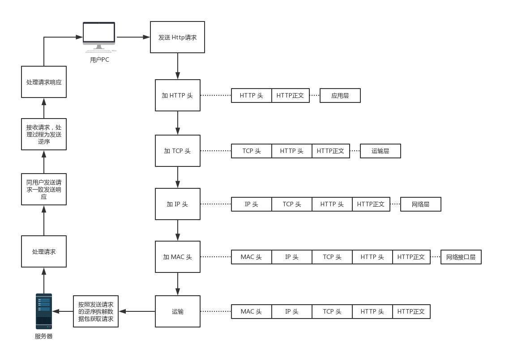

# HTTP 协议

## 概述

1. HTTP是Hyper Text Transfer Protocol（超文本传输协议）的缩写,其用于从万维网（WWW）服务器传输超文本到本地浏览器的传送协议。

2. HTTP是一个基于TCP/IP通信协议来传递数据（HTML 文件, 图片文件, 查询结果等）。

3. HTTP是一个属于应用层的协议，由于其简捷、快速的方式，适用于分布式超媒体信息系统。目前HTTP2.0协议已经提出，但还没有普及。

4. HTTP协议工作于客户端-服务端架构为上。浏览器作为HTTP客户端通过URL向HTTP服务端发送所有请求。服务端根据接收到的请求后，向客户端发送响应信息。

## 请求消息和响应消息

*查看一次百度首页为例*

### 请求

```http
Request Header
Request URL:  https://www.baidu.com/
Request Method: GET
Status Code: 200 OK
Remote Address: 121.43.166.29:443
```

* `Request URL` 请求的目标地址；

* `Request Method` 请求方式，对同一地址的不同请求方式服务器会做出不同的响应，默认的方法为 GET；

  > `GET`：请求指定的页面信息，并返回主体实体；
  >
  > `POST`：向指定资源提交数据进行处理请求（如上传文件、提交表单）。数据被包含在请求体当中。POST请求可能会导致新资源的建立，或者旧资源的更新；
  >
  > `HEAD`：类似 GET 请求，但不返回实体，用于获取报头；
  >
  > `PUT`：从客户端向服务器传送的数据用于取代指定的内容；
  >
  > `DELETE`：请求服务器删除指定资源；
  >
  > `CONNECT`：HTTP/1.1协议中预留给能够将连接改为管道方式的代理服务器；
  >
  > `OPTIONS`：允许客户端查看服务器的性能；
  >
  > `TRACE`：回显服务器收到的请求，主要用于测试和诊断。

  Request Method 只是一种规约，并不强制要求请求行为，具体请求方式的真实行为因程序而异。

* `status Code` 请求状态码，200 代表请求成功；

  常见状态码：

  > `200`：请求成功；
  > `301`：资源被永久转移至其他 URL；
  > `404`：请求的资源不存在；
  > `500`：内部服务器错误。

* `Remote Address` 最终请求服务器地址。

### 响应

```http
Response Header
Cache-Control: private
Connection: Keep-Alive
Content-Encoding: gzip
Content-Type: text/html;charset=utf-8
Date: Wed, 17 Apr 2019 13:46:01 GMT
Server: BWS/1.1
Set-Cookie: BDSVRTM=434; path=/
Set-Cookie: BD_HOME=1; path=/
Set-Cookie: H_PS_PSSID=1437_28777_21087_28767_28720_28558_28838_28585_26350_28518; path=/; 
```

* `Cache-Control` 浏览器缓存，分为两种模式：
  > `private`：私有，缓存只能用于单个用户；
  > `public`：公有，缓存可用于多个用户。
* `Connection` 控制客户端和服务器的连接：
  
  > `keep-alive`：打开链接；
  > `close`：表示客户端和服务器想要关闭连接。
* `Content-Encoding` 文档的编码方式，常见有 gzip，可减少文档的加载时间；
* `Content-Type` 表示文档属于什么 MIME 类型，通常默认 text/pain，需要显示的指明 text/html；
* `Date` 显示时间；
* `Server` 服务器类型；
* `Set-Cookie` 添加 Cookie。

## 工作流程



## 0.9、1.0、1.1和2.0版本比较

### 0.9

0.9 版本是 HTTP 协议发布的第一个版本，只支持`GET`方法且没有协议头，没有协议头导致只能传输纯文本无法传输图片。

0.9版本中每一次请求都会发起 TCP 链接，数据传输完成后便断开链接。

### 1.0

1.0 版本首先规定了可以传输任何格式的信息，故从此可以传输图片、视频等信息。

请求方式加入了`POST` 和`HEAD`方法 。

请求和响应格式发生了改变，每一次的通信必须包含信息头，用于描述一些数据。

响应对象以一个响应状态行开始

新增了状态码、内容编码、多部分发送等功能。

### 1.1

1.1 版本是目前的主流版本。

新增功能如下：

* 持久连接：TCP 连接默认不关闭，可以被多个请求复用。
* 管道机制：在同一个 TCP 连接里面，客户端可以同时发送多个请求。
* `Content-Length` 字段：一次 TCP 连接可以有多个回应，此字段用于区分数据包属于哪一次回应。
* `HOST` 字段：指定服务器的域名，使用此字段可以将请求发送至同一服务器的不同网站。

  ……

新增了`OPTIONS`、`PUT`、 `DELETE`、` TRACE`、` CONNEC`方法。

### 2.0

HTTP 2.0 版本发布于2015年，属于下一代 HTTP协议，目前应用较少。

HTTP 2.0 主要特点：

* 多路复用：在一个连接里，客户端和浏览器都可以同时发送多个请求或回应，而且不用按照顺序一一对应，这样就避免了"队头堵塞"。
* 二进制协议：2.0 版本的 HTTP 协议是纯二进制的协议，头部信息和主体信息都称为帧：头信息帧和数据帧。
* 头部压缩：当一个客户端向相同服务器请求许多资源时，像来自同一个网页的图像，将会有大量的请求看上去几乎同样的，这就需要压缩技术对付这种几乎相同的信息。在请求头中不在发送相同字段。
* 数据流：HTTP 2.0的数据包不是按顺序发送的，同一个连接里面连续的数据包，可能属于不同的回应。因此，必须要对数据包做标记，指出它属于哪个回应。每次请求和回应的所有数据包称为一个数据流。客户端和服务器可以发送型号中断数据流但不关闭 TCP 连接。
* 服务器推送：服务器可以主动向客户端发送信息。

  ……

